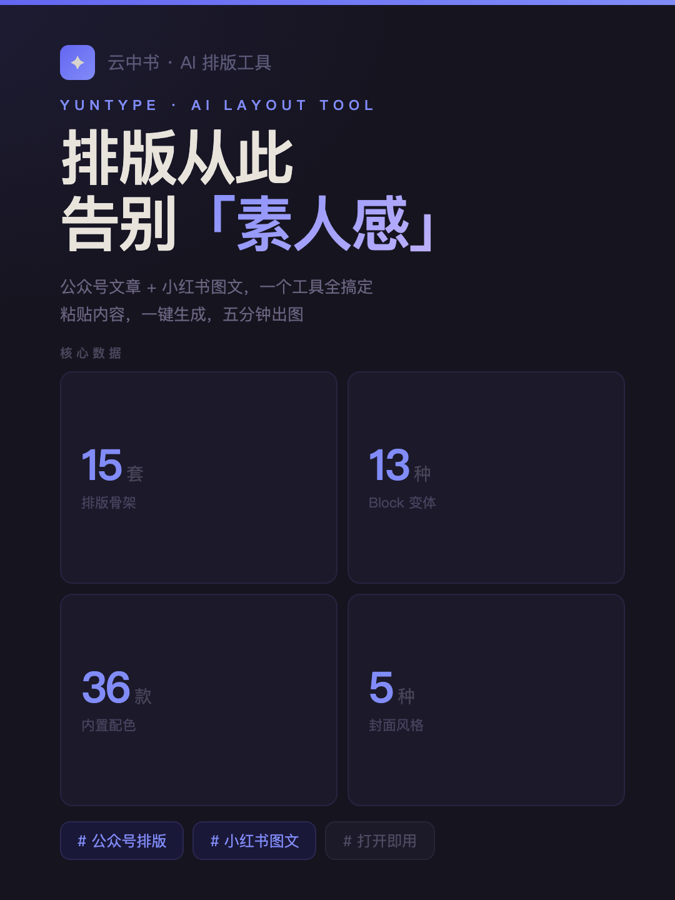
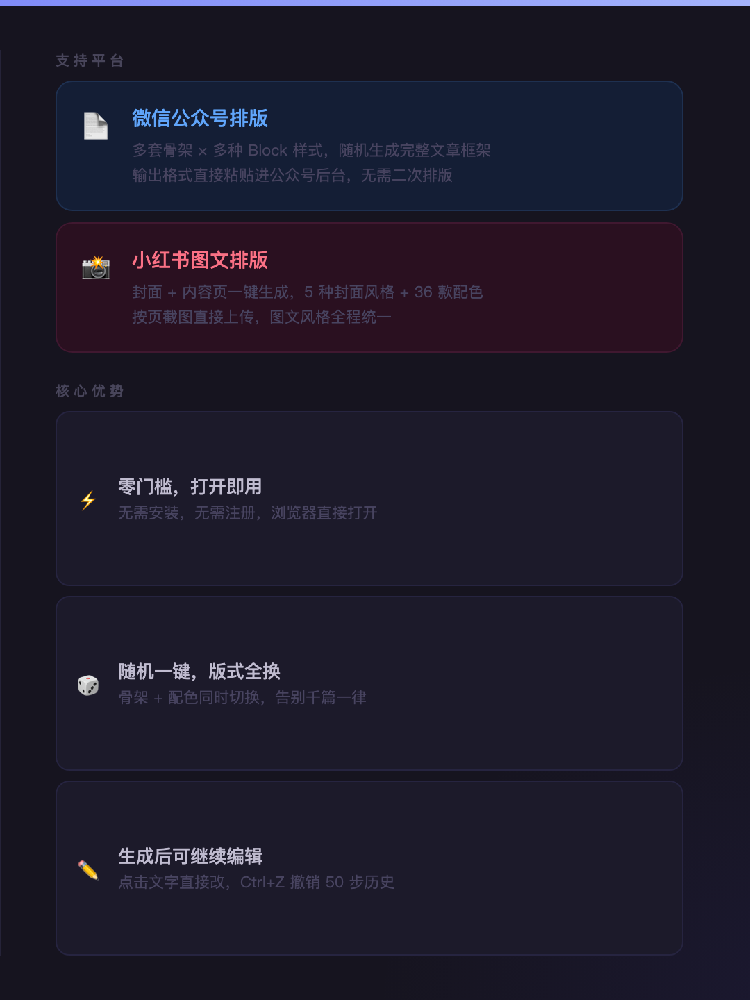
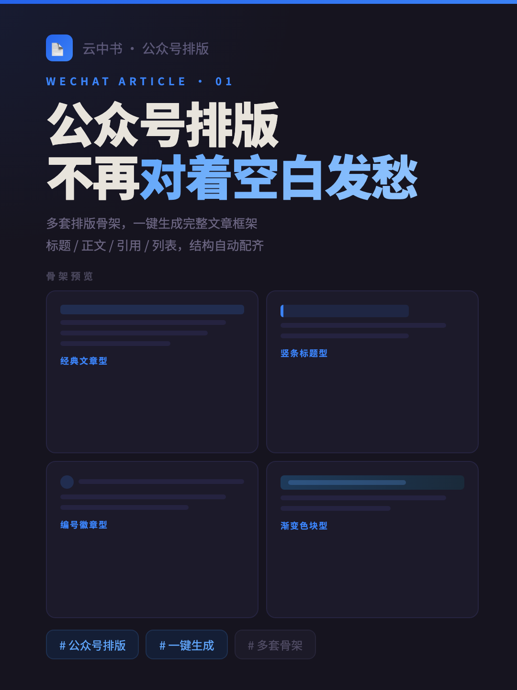
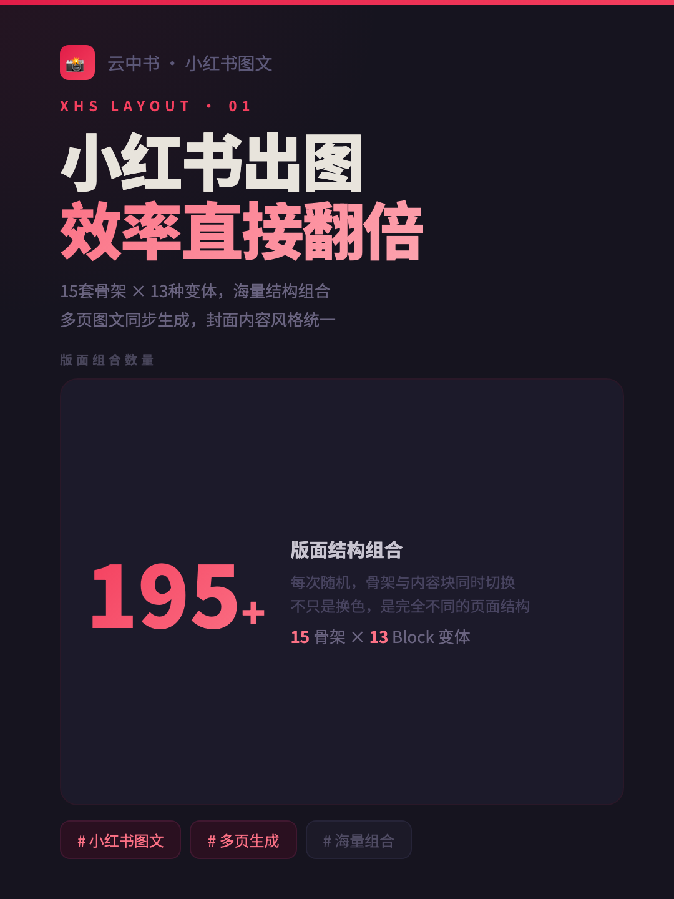
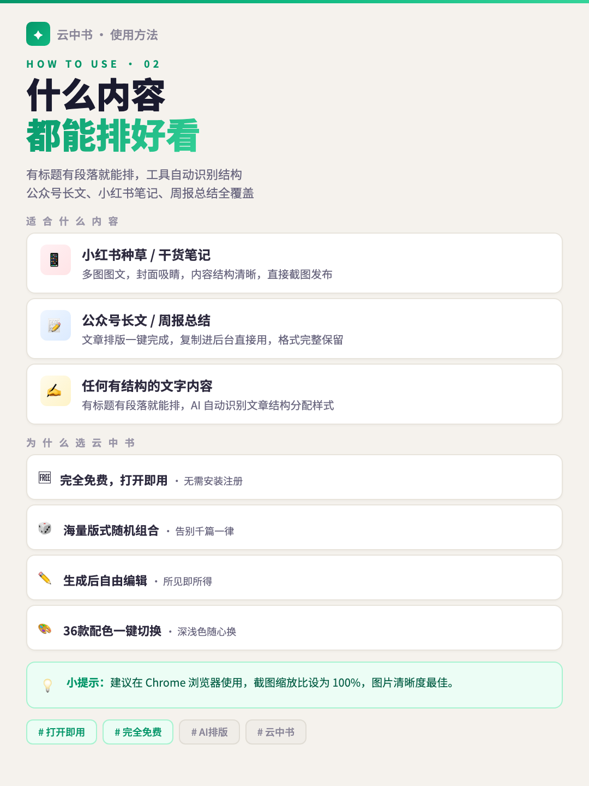
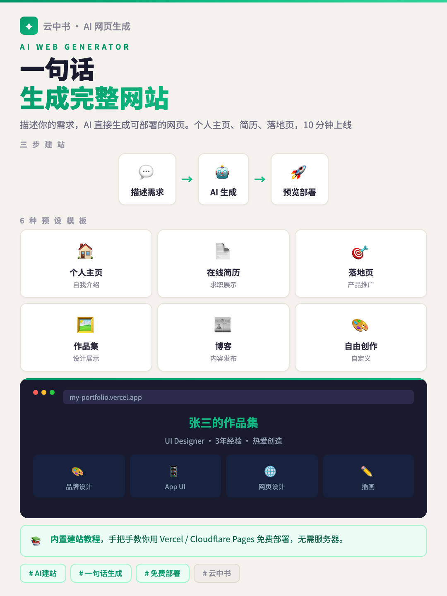
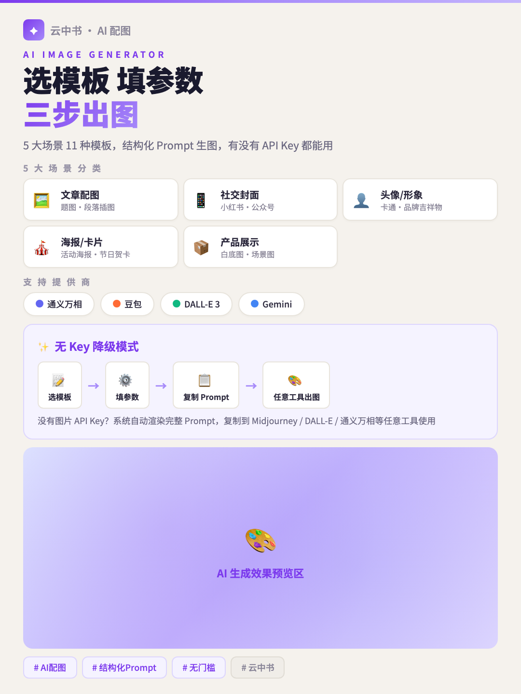
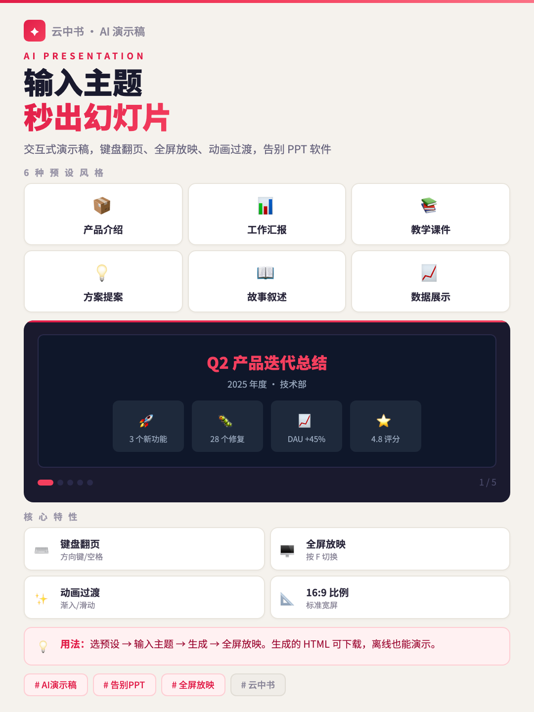

<div align="center">

# ☁️ 云中书 YunType

**AI 驱动的骨架排版引擎 · 15 蓝图 × 百万级组合 · 粘贴即排版**

*Paste your article. Get stunning layouts. Copy to WeChat & Xiaohongshu.*

[](LICENSE)
[](https://typescriptlang.org)
[](https://react.dev)
[](https://vitejs.dev)
[](/)
[](/)
[](/)
[](/)

---

[🇨🇳 中文](#-中文文档) · [🇺🇸 English](#-english-documentation)

</div>

---

<a name="-中文文档"></a>

## 🇨🇳 中文文档

### 💡 这是什么？

**云中书**是一个零后端、零账号的 AI 排版工具，帮助公众号和小红书创作者**一键生成专业排版**。

> 不需要设计能力。不需要开会员。粘贴文章，选个风格，复制走人。

```
📋 粘贴文章  →  🪄 纯文本整理  →  🎨 AI推荐排版  →  🔧 微调风格  →  📎 复制到微信 / 📸 下载图片组
```

<div align="center">
<table><tr>
<td></td>
<td></td>
</tr></table>
</div>

---

### 🚀 四种使用方式

云中书提供 **4 种使用方式**，覆盖从零代码到深度集成的所有场景：

| # | 方式 | 适合人群 | 一句话说明 |
|:---:|:---|:---|:---|
| 1️⃣ | [在线使用 Web App](#-方式一在线使用) | 所有人 | 打开网页，粘贴文章，一键排版 |
| 2️⃣ | [MCP Server 工具调用](#-方式二mcp-server) | Cline / Claude Code / Cursor 用户 | AI 助手直接调用百万级排版，无需额外 API Key |
| 3️⃣ | [Prompt Skill 提示词技能](#-方式三prompt-skill) | OpenClaw / GPTs / Coze 用户 | 导入技能描述，让平台 AI 学会排版 |
| 4️⃣ | [扔给 AI 自行处理](#-方式四扔给-ai-自行处理) | 懒人 / 极客 | 把仓库链接扔给 AI，让它自己搞定 |

---

#### 📱 方式一：在线使用

最简单的方式，打开即用：

**在线地址**：[https://yuanbw2025.github.io/yuntype/](https://yuanbw2025.github.io/yuntype/)

```
1. 打开网页
2. 粘贴你的 Markdown / 纯文本文章（支持一键整理纯文本为结构化 Markdown）
3. AI 自动推荐排版（或手动调节 15 套骨架蓝图 + 百万级插槽组合）
4. 复制到微信公众号 / 下载小红书图片组
```

<div align="center">
<table><tr>
<td></td>
<td></td>
<td></td>
</tr></table>
</div>

**本地运行**：

```bash
git clone https://github.com/yuanbw2025/yuntype.git
cd yuntype && npm install && npm run dev
# → http://localhost:5173
```

---

#### 🔌 方式二：MCP Server

> **MCP (Model Context Protocol)** 是 Anthropic 推出的开放协议，让 AI 助手能调用外部工具。云中书提供了 MCP Server，让 Cline / Claude Code / Cursor 等 AI 编辑器**直接调用骨架排版能力**，无需自己的 AI API Key。

**安装与构建**：

```bash
cd yuntype/mcp-server
npm install
npm run build
```

**在 Cline 中配置**（`cline_mcp_settings.json`）：

```json
{
  "mcpServers": {
    "yuntype": {
      "command": "node",
      "args": ["<你的路径>/yuntype/mcp-server/dist/index.js"],
      "disabled": false
    }
  }
}
```

**在 Claude Code 中配置**：

```bash
claude mcp add yuntype node <你的路径>/yuntype/mcp-server/dist/index.js
```

**在 Cursor 中配置**（`.cursor/mcp.json`）：

```json
{
  "mcpServers": {
    "yuntype": {
      "command": "node",
      "args": ["<你的路径>/yuntype/mcp-server/dist/index.js"]
    }
  }
}
```

**MCP 提供的工具**：

| 工具名 | 功能 | 参数 |
|:---|:---|:---|
| `yuntype_list_styles` | 列出所有可用的蓝图/插槽/配色/字体选项 | 无 |
| `yuntype_random_style` | 随机生成一个排版组合 | 无 |
| `yuntype_format` | 用指定风格排版 Markdown 文章 | `markdown`, `blueprint`, `color`, `font` |
| `yuntype_preset` | 使用预设风格快速排版 | `markdown`, `preset`（如 tech/literary/food 等） |

**MCP 资源**：

| 资源 URI | 说明 |
|:---|:---|
| `yuntype://style-guide` | 风格推荐指南，帮助 AI 根据文章类型选择最佳排版 |

**使用示例**（在 AI 助手中）：

```
"帮我把这篇文章用云中书排版，用科技风格"
→ AI 自动调用 yuntype_preset(markdown=文章内容, preset="tech")
→ 返回微信兼容的 HTML，直接粘贴到公众号编辑器
```

---

#### 📜 方式三：Prompt Skill（⭐ 推荐）

> **不需要任何 API Key，直接用你的 Claude Pro / Gemini 订阅额度！** 在 claude.ai 的 Artifacts 画布或 Google AI Studio 的 Canvas 中实时预览排版效果，自由搭配、自由调试。

**完整版 Skill**（推荐）— 包含全部骨架蓝图的完整数据和渲染规则，AI 直接变成排版引擎：

1. 打开 [`yuntype/skill/yuntype-complete-skill.md`](skill/yuntype-complete-skill.md)
2. 复制全部内容到 claude.ai 的 Project System Prompt / AI Studio 的 System Instructions
3. 发送文章 → AI 分析推荐 → **Artifacts/Canvas 画布直接预览** → 说"换个暖色"即时调整 → 满意后复制 HTML

```
你：帮我排版这篇文章（粘贴文章）
AI：推荐 B04双线学术 + 烟灰高级 + F1现代简约
   （画布中显示排版效果）

你：颜色太冷了，换个暖色
AI：切换为 B02日式留白 + 奶茶温柔（画布立即刷新）

你：完美！
AI：请在画布中复制 HTML → 粘贴到公众号编辑器
```

**轻量版 Skill** — 仅做推荐，引导用户去 Web App 操作：

- 文件：[`yuntype/skill/yuntype-skill.md`](skill/yuntype-skill.md)
- 适用于 OpenClaw / GPTs / Coze 等不支持画布的平台

> 💡 完整版 Skill 的核心优势：**用订阅额度代替 API Key**。你订阅的 Claude Pro / Gemini Advanced 本身就是排版引擎，不需要额外付费。

---

#### 🤖 方式四：扔给 AI 自行处理

> 最省事的方式 —— 把仓库链接直接扔给你的 AI 助手，让它自己阅读代码、理解排版逻辑、帮你排版。

**操作方法**：

直接把以下内容发给你的 Claude Code / OpenClaw / Cline / Cursor / ChatGPT：

```
请阅读这个开源排版工具的仓库：https://github.com/yuanbw2025/yuntype
理解它的 V2 骨架引擎（15 套蓝图 × 6 类插槽 × 48 变体 × 11 配色 × 3 字体），
然后帮我把以下文章用"科技风格"排版成微信公众号兼容的 HTML：

（粘贴你的文章）
```

> 足够聪明的 AI 会自己读懂 `src/lib/atoms/blueprints.ts` 和 `src/lib/atoms/slots.ts` 下的蓝图与插槽数据，以及 `src/lib/render/wechat.ts` 的渲染逻辑，然后生成排版后的 HTML。

---

### ✨ 核心特性

| 特性 | 说明 |
|:---:|:---|
| 🏗️ **V2 骨架引擎** | 15 套蓝图（B01–B15）定义页面结构，6 类插槽（标题/引用/列表/分隔/正文/节标题）共 48 变体，百万级组合永不撞款 |
| 🎨 **11 套配色** | 浅色 8 套 + 深色 3 套，公众号与小红书共享配色系统 |
| 🤖 **AI 智能推荐** | 11 大 AI 提供商（通义千问/DeepSeek/豆包/OpenAI/Gemini/Claude/Grok 等），分析文章自动匹配最佳排版 |
| 🪄 **纯文本整理** | 粘贴杂乱纯文本，一键识别标题/列表/引用，自动转为结构化 Markdown |
| 🔌 **MCP Server** | 让 Cline/Claude Code/Cursor 直接调用排版能力，无需额外 API Key |
| 📜 **Prompt Skill** | 在 OpenClaw/GPTs/Coze 中作为技能使用 |
| 🎚️ **滑条微调** | 调"感觉"而不是调参数 — 色温、装饰密度、间距... |
| 📝 **公众号模式** | 输出微信兼容的内联 CSS 富文本，直接粘贴到公众号编辑器 |
| 📸 **小红书模式** | 四维度控制（比例/配色/字体/骨架），自动分页，5 种封面变体，ZIP 打包导出 |
| 📊 **信息图模式** | 流程图/对比表/知识卡片/时间线，程序化生成精美信息图 |
| 🎨 **AI 配图** | 5 大场景 11 个结构化模板，集成通义万相/豆包/DALL-E 3/Gemini Imagen，无 API Key 可降级为 Prompt 顾问 |
| 🌐 **网页生成** | AI 生成完整单文件 HTML 网页，6 种预设场景，iframe 实时预览，内嵌 GitHub+Vercel 建站教程 |
| 🎬 **演示稿** | AI 生成 16:9 交互式演示，键盘/点击导航，全屏放映，6 种预设场景 |
| ✒️ **10 种字体** | 按需 CDN 加载，标题/正文独立选择 |
| 🌙 **暗黑模式** | 深色主题，Ctrl+D 一键切换 |
| ⌨️ **键盘快捷键** | Ctrl+Shift+R 随机组合 / Ctrl+E 导出 / Ctrl+D 暗黑模式 |
| 💼 **品牌预设** | 保存最多 20 套品牌预设，一键调用 |
| 🔑 **零门槛** | 零后端、零账号、零付费墙，核心功能完全离线可用 |

#### 🆕 三大新功能

<div align="center">
<table><tr>
<td></td>
<td></td>
<td></td>
</tr></table>
</div>

---

### 🏗️ V2 骨架引擎

云中书 V2 的排版不是"模板"，而是**骨架蓝图 + 原子插槽的自由组合**：

```
┌──────────────────────────────────────────────────────────┐
│                                                          │
│   排版方案 = 骨架蓝图 × 插槽变体 × 配色 × 字体          │
│              15 套      48 变体    11 套   3 种          │
│                                                          │
│              = 百万级以上独特组合                        │
│                                                          │
└──────────────────────────────────────────────────────────┘
```

#### 📐 15 套骨架蓝图（B01–B15）

| 编号 | 名称 | 风格标签 |
|:---|:---|:---|
| B01 | 极简清爽 | 干净 · 通用 · 适合知识类 |
| B02 | 日式留白 | 克制 · 高级感 · 适合散文 |
| B03 | 线条主导 | 结构清晰 · 适合教程 |
| B04 | 双线学术 | 严谨 · 适合分析/研究 |
| B05 | 色块标签 | 活泼 · 适合科普/清单 |
| B06 | 交替色带 | 层次感强 · 适合对比内容 |
| B07 | 卡片模块 | 信息密度高 · 适合干货 |
| B08 | 气泡圆润 | 亲切 · 适合轻松话题 |
| B09 | 杂志编辑 | 视觉冲击 · 适合封面/头图 |
| B10 | 首字下沉 | 文学气息 · 适合长文 |
| B11 | 编号步骤 | 流程清晰 · 适合教程/攻略 |
| B12 | 时间线 | 历程感 · 适合回顾/故事 |
| B13 | 文艺散文 | 诗意 · 适合情感类 |
| B14 | 商务左标签 | 正式 · 适合报告/简报 |
| B15 | 几何装饰 | 现代感 · 适合科技/设计 |

#### 🧩 6 类插槽 · 48 变体

| 插槽类型 | 变体数 | 说明 |
|:---|:---:|:---|
| 标题插槽 | 10 | 控制 H1/H2/H3 的视觉表现 |
| 引用插槽 | 8 | 控制 blockquote 样式 |
| 列表插槽 | 8 | 控制无序/有序列表样式 |
| 分隔插槽 | 8 | 控制章节之间的分隔装饰 |
| 正文插槽 | 6 | 控制段落字距/行高/缩进 |
| 节标题插槽 | 6 | 控制小节标题样式 |

#### 🌈 11 套配色方案

| 浅色系 | 深色系 |
|:---|:---|
| 🍵 奶茶温柔 · 🌿 薄荷清新 · 🍑 蜜桃活力 · 🌫️ 烟灰高级 · 💜 藤紫文艺 · 🌊 天青雅致 · 🌸 樱花浪漫 · 🏖️ 落日暖橘 | 🌙 墨夜金字 · 🖤 深空科技 · 🍷 暗夜酒红 |

#### ✒️ 3 种字体气质

| 代号 | 名称 | 适合场景 |
|:---|:---|:---|
| F1 | 现代简约 | 科技 · 商务 · 技术教程 |
| F2 | 文艺优雅 | 散文 · 书评 · 旅行 |
| F3 | 活泼趣味 | 美食 · 美妆 · 校园 |

---

### 🤖 AI 能力

| 功能 | 支持的提供商 |
|:---:|:---|
| 📊 **文章分析 · 排版推荐** | 通义千问、DeepSeek、豆包、OpenAI、Gemini、Claude、Grok、Moonshot、智谱、SiliconFlow、自定义（共 11 个） |
| 🖼️ **AI 配图** | 通义万相、豆包、DALL-E 3、Gemini Imagen（5 大场景 11 模板） |
| 📈 **信息图生成** | 流程图、对比表、知识卡片、时间线 |
| 🌐 **网页生成** | 通义千问、DeepSeek、豆包、OpenAI、Gemini、Claude 等（共 11 个） |
| 🎬 **演示稿生成** | 通义千问、DeepSeek、豆包、OpenAI、Gemini、Claude 等（共 11 个） |

> 💡 自带 API Key 模式，浏览器直连 AI 提供商，内容不经过任何中间服务器，100% 隐私安全。

---

### 🏗️ 项目结构

```
yuntype/
├── index.html                  # 入口 HTML
├── package.json                # React 19 + TypeScript + Vite 6
├── vite.config.ts              # Vite 配置
│
├── src/
│   ├── main.tsx                # React 入口
│   ├── App.tsx                 # 主应用（三栏工作台 + 暗黑模式 + 快捷键）
│   │
│   ├── lib/
│   │   ├── atoms/              # 🏗️ V2 骨架引擎
│   │   │   ├── blueprints.ts   #    15 套骨架蓝图定义（B01–B15）
│   │   │   ├── slots.ts        #    6 类 48 种插槽变体
│   │   │   ├── colors.ts       #    11 套配色方案
│   │   │   └── fonts.ts        #    3 种字体气质
│   │   ├── render/             # 📄 渲染核心（Markdown解析/公众号/小红书/信息图）
│   │   ├── ai/                 # 🤖 AI 模块（11个提供商统一接口 + 配图/网页/演示稿生成）
│   │   ├── fonts/              # ✒️ 字体管理器（10种字体/按需CDN）
│   │   ├── storage.ts          # 💾 本地存储
│   │   └── export/             # 📤 导出工具（剪贴板 + 图片）
│   │
│   └── components/             # 🧩 UI 组件
│
├── mcp-server/                 # 🔌 MCP Server（Model Context Protocol）
│   ├── package.json
│   └── src/
│       └── index.ts            #    MCP 工具（4个工具 + 1个资源）
│
├── skill/                      # 📜 Prompt Skill
│   └── yuntype-skill.md        #    技能描述文件（OpenClaw/GPTs/Coze）
│
└── docs/                       # 📚 产品文档与宣传图
```

---

### 🛠️ 技术栈

| 层 | 技术 | 说明 |
|:---|:---|:---|
| 框架 | React 19 + TypeScript 5.7 | 组件化开发 |
| 构建 | Vite 6 | 极速 HMR |
| 排版输出 | 纯内联 CSS | 100% 微信兼容 |
| AI | 11 个提供商统一接口 | 通义千问/DeepSeek/豆包/OpenAI/Gemini/Claude/Grok/Moonshot/智谱/SiliconFlow/自定义 |
| MCP | @modelcontextprotocol/sdk | Cline/Claude Code/Cursor 工具调用 |
| PWA | Service Worker + Manifest | 离线可用，可安装到桌面 |
| 部署 | Vercel | 智能缓存 + SPA 重写 |

---

### 🗺️ 开发路线图

```
Phase 1 ✅  → MVP：公众号排版核心
Phase 2 ✅  → 四维度选择面板 + 8套预设 + 微调滑条
Phase 3 ✅  → 小红书图片组生成
Phase 4 ✅  → 信息图引擎 + AI文生图 + 品牌预设
Phase 5 ✅  → AI文章分析（9→11个提供商）+ 字体管理器 + 移动端适配
Phase 6 ✅  → 暗黑模式 + 快捷键 + 封面5变体 + SEO/PWA
Phase 7 ✅  → MCP Server + Prompt Skill + Claude/Grok支持
Phase 8 ✅  → V2 骨架引擎：15 蓝图 + 6类插槽 48变体 + 纯文本整理 + 小红书V2
Phase 9 ✅  → 创作者工具集：网页生成 + AI配图升级(5场景11模板) + 演示稿 + 顶栏整理 + 移动端适配
Phase 10 🔲 → MCP/Skill V2 适配 + 多语言 + 模板市场
```

---

### 🤝 参与贡献

欢迎贡献！无论是 Bug 修复、新配色方案、新骨架蓝图，还是文档改进都非常欢迎。

1. Fork 本仓库
2. 创建特性分支 (`git checkout -b feature/amazing-feature`)
3. 提交改动 (`git commit -m 'feat: add amazing feature'`)
4. 推送分支 (`git push origin feature/amazing-feature`)
5. 发起 Pull Request

---

### 📄 许可

[MIT License](LICENSE) — 自由使用，开源万岁。

---
---

<a name="-english-documentation"></a>

<div align="center">

## 🇺🇸 English Documentation

</div>

### 💡 What is YunType?

**YunType** (云中书, literally "Book in the Clouds") is a **zero-backend, zero-login AI typesetting engine** that helps WeChat Official Account and Xiaohongshu creators generate **professional layouts instantly**.

> No design skills needed. No subscription. Paste your article, pick a style, copy and go.

```
📋 Paste  →  🪄 Auto-organize  →  🎨 AI-recommend  →  🔧 Fine-tune  →  📎 Copy to WeChat / 📸 Download
```

<div align="center">
<table><tr>
<td></td>
<td></td>
</tr></table>
</div>

---

### 🚀 Four Ways to Use

| # | Method | For | Description |
|:---:|:---|:---|:---|
| 1️⃣ | [Online Web App](#-method-1-online-web-app) | Everyone | Open browser, paste article, get layout |
| 2️⃣ | [MCP Server](#-method-2-mcp-server) | Cline / Claude Code / Cursor users | AI assistant calls million-level layouts directly |
| 3️⃣ | [Prompt Skill](#-method-3-prompt-skill) | OpenClaw / GPTs / Coze users | Import skill description for AI platforms |
| 4️⃣ | [Let AI Figure It Out](#-method-4-let-ai-figure-it-out) | Lazy geniuses | Throw the repo link to your AI |

---

#### 📱 Method 1: Online Web App

**Live Demo**: [https://yuanbw2025.github.io/yuntype/](https://yuanbw2025.github.io/yuntype/)

```bash
# Or run locally:
git clone https://github.com/yuanbw2025/yuntype.git
cd yuntype && npm install && npm run dev
# → http://localhost:5173
```

---

#### 🔌 Method 2: MCP Server

> **MCP (Model Context Protocol)** is Anthropic's open protocol for AI tool invocation. YunType's MCP Server lets Cline / Claude Code / Cursor **directly call the V2 skeleton layout engine** — no extra API key needed.

**Install & Build**:

```bash
cd yuntype/mcp-server
npm install && npm run build
```

**Configure in Cline** (`cline_mcp_settings.json`):

```json
{
  "mcpServers": {
    "yuntype": {
      "command": "node",
      "args": ["<your-path>/yuntype/mcp-server/dist/index.js"]
    }
  }
}
```

**Configure in Claude Code**:

```bash
claude mcp add yuntype node <your-path>/yuntype/mcp-server/dist/index.js
```

**Available MCP Tools**:

| Tool | Description |
|:---|:---|
| `yuntype_list_styles` | List all blueprints, slots, colors, and font options |
| `yuntype_random_style` | Generate a random style combination |
| `yuntype_format` | Format Markdown with specified blueprint and slot parameters |
| `yuntype_preset` | Quick format using preset styles (tech/literary/food...) |

---

#### 📜 Method 3: Prompt Skill

Import [`yuntype/skill/yuntype-complete-skill.md`](skill/yuntype-complete-skill.md) into claude.ai Project System Prompt or Google AI Studio System Instructions. The AI becomes a full typesetting engine — preview in Artifacts/Canvas, adjust conversationally, copy the HTML when satisfied.

> 💡 Core advantage: **use your subscription quota instead of API keys**. Claude Pro / Gemini Advanced itself becomes the layout engine.

---

#### 🤖 Method 4: Let AI Figure It Out

Send this to Claude Code / OpenClaw / Cline / Cursor / ChatGPT:

```
Read this open-source typesetting tool: https://github.com/yuanbw2025/yuntype
Understand its V2 Skeleton Engine (15 blueprints × 6 slot types × 48 variants × 11 colors × 3 fonts),
then format my article in "tech style" as WeChat-compatible HTML:

(paste your article)
```

---

### ✨ Key Features

| Feature | Description |
|:---:|:---|
| 🏗️ **V2 Skeleton Engine** | 15 blueprints (B01–B15) define page structure; 6 slot types / 48 variants handle individual elements; millions of unique combinations |
| 🎨 **11 Color Schemes** | 8 light + 3 dark, shared between WeChat and Xiaohongshu modes |
| 🤖 **AI Smart Matching** | 11 AI providers (Qwen/DeepSeek/Doubao/OpenAI/Gemini/Claude/Grok...) auto-recommend the best layout |
| 🪄 **Plain Text Organize** | Paste messy plain text → one-click convert to structured Markdown |
| 🔌 **MCP Server** | Direct tool invocation from Cline/Claude Code/Cursor |
| 📜 **Prompt Skill** | Use as a skill in OpenClaw/GPTs/Coze |
| 📝 **WeChat Mode** | Inline-CSS output, paste directly into WeChat editor |
| 📸 **Xiaohongshu Mode** | 4-dimension control (ratio/color/font/blueprint), auto-paginate, 5 cover variants, ZIP export |
| 📊 **Infographic Mode** | Flowcharts / comparison tables / knowledge cards / timelines |
| 🎨 **AI Image Gen** | 5 scene categories, 11 structured templates; Tongyi / Doubao / DALL-E 3 / Gemini; degrades to Prompt Advisor without API key |
| 🌐 **Web Page Gen** | AI generates complete single-file HTML pages, 6 presets, live iframe preview, built-in GitHub+Vercel deploy tutorial |
| 🎬 **Presentation** | AI generates interactive 16:9 slides with keyboard/click navigation, fullscreen playback, 6 presets |
| 🌙 **Dark Mode** | Ctrl+D toggle, persistent |
| 🔑 **Zero Barrier** | No backend, no account, no paywall |

#### 🆕 New Features

<div align="center">
<table><tr>
<td></td>
<td></td>
<td></td>
</tr></table>
</div>

---

### 🏗️ V2 Skeleton Engine

```
Layout = Blueprint × Slot Variants × Color × Font
          15 sets    48 variants    11 sets  3 types

        = Millions of unique combinations
```

**15 Blueprints (B01–B15)**: 极简清爽 · 日式留白 · 线条主导 · 双线学术 · 色块标签 · 交替色带 · 卡片模块 · 气泡圆润 · 杂志编辑 · 首字下沉 · 编号步骤 · 时间线 · 文艺散文 · 商务左标签 · 几何装饰

**6 Slot Types**: Title (10 variants) · Quote (8) · List (8) · Divider (8) · Paragraph (6) · Section Header (6)

---

### 🛠️ Tech Stack

| Layer | Tech |
|:---|:---|
| Framework | React 19 + TypeScript 5.7 + Vite 6 |
| Layout Output | Pure Inline CSS (100% WeChat compatible) |
| AI | 11 Providers Unified Interface |
| MCP | @modelcontextprotocol/sdk |
| PWA | Service Worker + Manifest (offline capable) |
| Deploy | Vercel |

---

### 📄 License

[MIT License](LICENSE) — Free to use. Open source forever.

---

<div align="center">

**Made with ☁️ by [yuanbw2025](https://github.com/yuanbw2025)**

*云中谁寄锦书来？*

</div>
